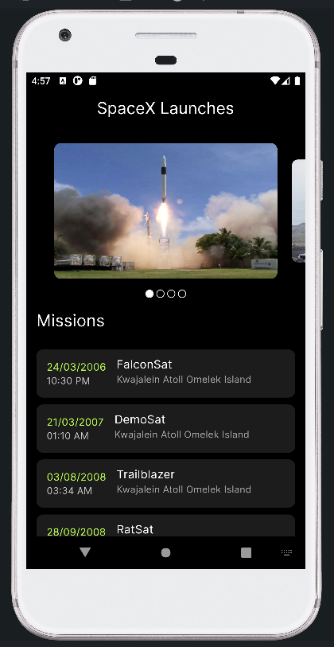

# SpaceX - rocket launch data application
An application for seeing data about SpaceX rockets and their flights.

### Functionality
- See rockets' images in slider
- Swipe carousel slider for next rocket in queue

### Technologies
- Flutter, Dart
- dio: ^5.2.1
- dartz: ^0.10.1
- flutter_bloc: ^8.1.3
- equatable: ^2.0.5
- get_it: ^7.6.0
- carousel_slider: ^4.2.1
- carousel_indicator: ^1.0.6
- dots_indicator: ^3.0.0
- intl: ^0.18.1
- url_launcher: ^6.1.11
- font_awesome_flutter: ^10.4

### UI

<table>
  <tr>
    <td align="center">
      
    </td>
  </tr>
